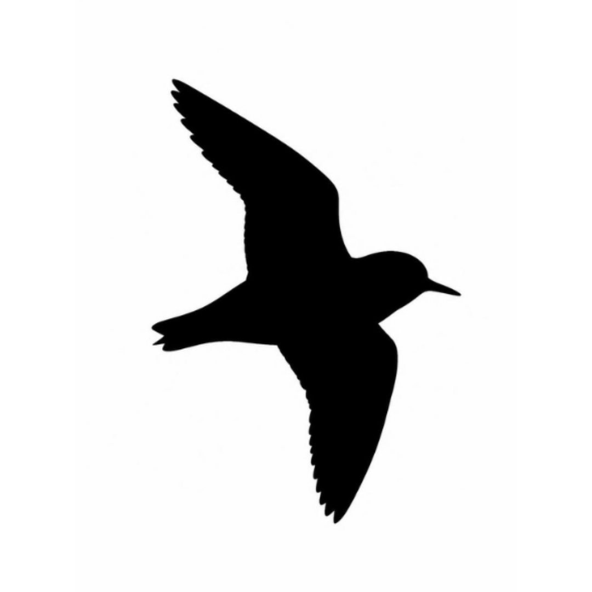

  

<h1 align="center">Plover Programming Language</h1>

Welcome to **Plover**, a fluent and declarative programming language built for seamless application development. Plover eliminates boilerplate code by structuring your application into five distinct, intuitive pipeline phases.

## The Plover Philosophy

Plover is built on the premise that building apps should read like natural language. The core architecture relies on a fluid chain of operations that takes your project from a blank canvas to a running application. 

### Core Application Lifecycle
Every standard Plover application follows this exact sequence:
* **Initialization**: The application shell is born using the app creation module.
* **Configuration**: Core routing, state, environment properties, and system permissions are set using the app configs module.
* **Styling**: Themes, colors, spacing, and layout properties are defined using the app styling module.
* **Content**: Views, data bindings, structural elements, and text assets are injected using the app content module.
* **Execution**: The runtime processes all parameters and launches the primary asynchronous event-handling cycle using the app loop module.

## Getting Started

* **Download**: Retrieve the latest compiled binary from the official platform distribution page.
* **Path Setup**: Add the executable directory to your system environment path variable.
* **Execution**: Run the application runner command line tool followed by the path to your source file.

## Key Features

* **Fluent Pipeline Architecture**: Write highly readable code that enforces a strict and clean separation of concerns.
* **Declarative Parameter Mapping**: Manage application state and aesthetic variables via simple dictionary mappings.
* **Optimized Native Event Loop**: Hand off your completed configuration directly to a low-overhead runtime architecture with a single trigger.
